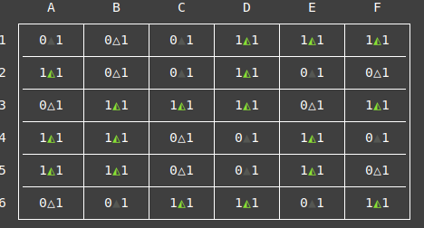
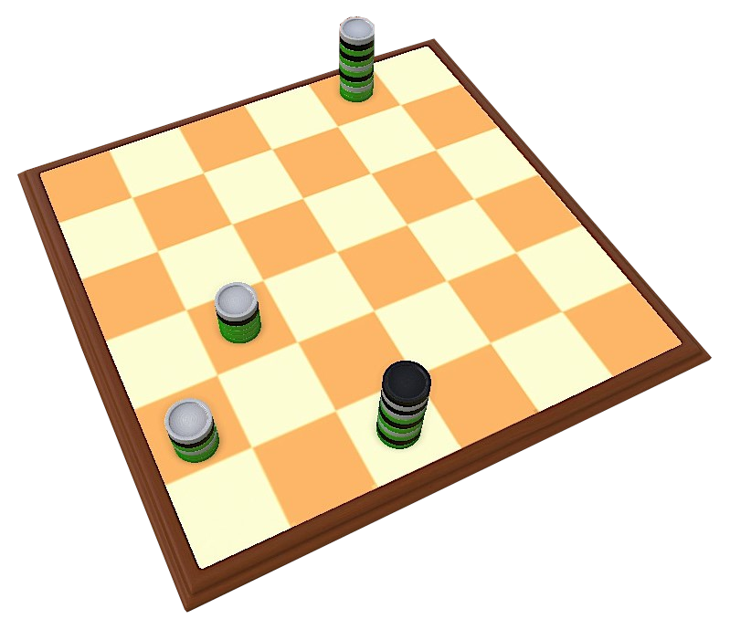

# Greener ⚪🟢⚫


## Authors

This project was developed by *Greener1 / Class 4*, of which the members are:

- Ana Inês Oliveira de Barros (*up201806593*)
- Eduardo da Costa Correia (*up201806433*)

## Description

**Greener** is a capturing game for 2 players, where both must capture the same colour.

### Material

**Basic:** a 6×6 board, 9 black pyramids 18 green pyramids and 9 white pyramids.
**Normal:** a 6×9 board, 13 black pyramids, 18 green pyramids, 13 white pyramids.
**Advanced:** a 9×9 board, 20 black pyramids and 41 green pyramids, 20 white pyramids.

### Definition

A **stack** is either one pyramid or several pyramids stacked on top of each other.
It is controlled by the colour of the topmost pyramid. 
So a White ⚪ stack is a stack of any height with a white pyramid on top, and so on...
 

### Setup

The board starts full of pyramids, randomly placed. 
Each player has an allocated colour (Black ⚫ / White ⚪) and they control every piece or stack of their respective color.
Green 🟢 is a neutral colour.


### How to play

Players take turns (starting by Black ⚫) capturing pyramids or stacks of any colour orthogonally (on the same row or collumn and with no stacks between them).
On your turn you must make one capture if possible, otherwise you pass the turn.
The game ends when all players pass in succession.
The player with the most green  pyramids captured (being part of stacks they control) wins the game. 
In case of a tie, the player with the highest stack wins. If the tie persists, play again.

### Gameplay Overview

Here's an example of a typical turn in the game.
In this case, it's the black player's turn, so they could move either the stack **c** or **a**.
In this case, they could capture the stack  **b**, **c**,, **d** or **e**, but not **f** because **e** is in between.
Capturing **b** is the best move Black ⚫ can make, since it not only gives him one more green piece, it also forfeits White's ⚪ control of that stack.


### More Information

- [BoardGameGeek entry](https://boardgamegeek.com/boardgame/227145/greengreenergreenest)
- [Official Rules](https://nestorgames.com/rulebooks/GREENGREENERGREENEST_EN.pdf)

## Game Structure

### Pieces, Stacks & Cells

The number of pieces on the board is fixed. There are 36 pieces 18 of the pieces are green, 9 are black and the other 9 are white.

To represent each piece:
- **w** is a White piece
- **b** is a Black piece
- **g** is a Green piece

All the playable pieces are put on the board at the start of the game. For that reason, there is no need to represent pieces that are outside the table. 

On the other hand, captured pieces are important since winning the game depends on the height of the stack and the number of green pieces in a stack. This means we have to store captured pieces in order to count the height of a stack and the number of green pieces. By representing a cell as a list, we can store all this information.

**Examples:**
- **[]** is an empty cell
- **[w]** is a cell with a white piece
- **[w, g, b]** is a cell with a white stack (the top piece is white).

### Game State / Board

To internally store the **Board** we used a list of lists that represents the board cells and the stacks in each one of them. In other words, the board is a list and has a list of rows. Each row has a list of cells. Each cell is a list of pieces since we can have multiple pieces in a cell. Here is an example of how a **Board** is stored:

```prolog
% Board Representation

[
[[b], [w], [b], [g], [g], [g]],
[[g], [w], [b], [g], [b], [w]],
[[w], [g], [g], [g], [w], [g]],
[[g], [g], [w], [b], [g], [b]],
[[g], [g], [w], [b], [g], [w]],
[[w], [b], [g], [g], [b], [g]]
]
```

Since there is no more relevant information besides the board (all the pieces stay on the board during the game), **GameState** is represented only by the board.

## Game Visualization

To visualize a **GameState** we use *display_game/2*. It shows what player is playing next and uses *display_board/1*.

In our code, *display_board/1* is responsible for displaying the Board. We display the board row by row and we take advatage of *print/1* to print the numbers and of *put_code* in order to print ascii characters so we can have a pretty and formatted way of displaying the board.

Our representation uses several Unicode characters and has to be monospaced font, so we recommend using *Cascadia Mono*, that already comes with the default SicStus installation.

In each cell we have 2 numbers and a Unicode character separating them. The number on the right represents the number of green pieces of the cell/stack. The number on the left represents the height of the stack in the cell. The unicode character represents the color of the top piece of the stack and is one of these:

- △ - White Piece
- ◭ - Green Piece
- ▲ - Black Piece

We included some mockups for comparison and better visualization.


<br>

### Initial State

**Mockup**


**Our display of the board**

<br>

**Obtained by running this:**

```prolog
display_board(
[[[b], [w], [b], [g], [g], [g]],
[[g], [w], [b], [g], [b], [w]],
[[w], [g], [g], [g], [w], [g]],
[[g], [g], [w], [b], [g], [b]],
[[g], [g], [w], [b], [g], [w]],
[[w], [b], [g], [g], [b], [g]]]).
```

### Middle State

**Mockup**


**Our display of the board**

<br>

**Obtained by running this:**

```prolog
display_board(
[[[], [], [b], [], [b, g, w, g, g], []],
[[], [w], [], [b, g], [], []],
[[], [g], [], [g], [], []],
[[w, b, g, w, g], [g], [], [], [], []],
[[g], [g], [b, g, w], [], [g], []],
[[], [w, b], [g], [], [], [b, w, b, w, g, b, g, w, g]]]).
```

### Final State

**Mockup**



**Our display of the board**

<br>

**Obtained by running this:**

```prolog
display_board(
[[[], [], [], [], [w, b, g, b, g, w, g, b, g, w, g, g], []],
[[], [], [], [], [], []],
[[], [], [], [], [], []],
[[], [w, b, g, g, g], [], [], [], []],
[[w, b, g, w, g, g], [], [], [], [], []],
[[], [], [b, w, b, w, g, b, g, w, g, b, g], [], [], []]]).
```


## Generating a board (initial GameState)

As the rules of the game state, the initial board must have the pieces randomly distributed across the board. To achieve this, we start with a list with all the pieces based on the number of columns and rows. Example:

```prolog
% List with full set of pieces
% 9 blacks, 9 whites & 18 greens 
pieces(
['w', 'w', 'w', 'w', 'w', 'w', 'w', 'w', 'w',
 'g', 'g', 'g', 'g', 'g', 'g', 'g', 'g', 'g', 
 'g', 'g', 'g', 'g', 'g', 'g', 'g', 'g', 'g',
 'b', 'b', 'b', 'b', 'b', 'b', 'b', 'b', 'b']).
```

 Then, we shuffle them and fill the empty board row by row. Demonstrated here:

 ```prolog
% Returns a shuffled list from a list of pieces

shuffle_board(Shuffled, Collumns, Rows) :-
    Size = Collumns * Rows,                 % Calculates size of board
    W is div(Size, 4),                      % Calculates number of white pieces
    B = W,                                  % Number of black pieces is the same as white pieces
    G = Size - (W + B),                     % Calculates number of green pieces
    pieces(W, G, B, Pieces),                % Creates list with all pieces
    random_permutation(Pieces, Shuffled).   % Shuffles list of pieces.

% Generates random board 
generate_board(Collumns, Rows, Board) :-
    shuffle_board(Shuffled, Collumns, Rows),     % Shuffles all pieces from the list
    fill_board(Shuffled, Collumns, Rows, Board). % Fills board with the pieces from list
 ```
 
 
 
 
 
 
 
 ## List of Valid Moves
 
 To generate the list of valid moves, for a given player and game state, we use the predicate `valid_moves(+BoardIn, +Player, -ListOfMoves)`.
 
 ```prolog
valid_moves(BoardIn, Player, ListOfMoves) :- % Gets all possible moves
    findall(BoardOut, valid_move(Player, BoardIn, BoardOut), ListOfMoves).
```
 
 With *findall/3* we are able to get a list with all the possible moves for a player with a certain board. *valid_move/3* executes a valid move to the input board and retrieves the new board.

```prolog

valid_move(Player, BoardIn, BoardOut) :-
    board_dimensions(BoardIn, Width, Height),             % Get width & height

    exclusive_between(-1, Height, I0),                    % Generate start cell coordinates
    exclusive_between(-1, Width, J0),
    get_cell(BoardIn, I0, J0, StackStart),                % Get start cell
    nth0(0, StackStart, Player),                          % Piece is controlled by player

    exclusive_between(-1, Height, I1),                    % Generate end cell coordinates
    exclusive_between(-1, Width, J1),
    get_cell(BoardIn, I1, J1, StackEnd),                  % Get end cell
    \+ is_empty(StackEnd),                                % Cell is not empty

    \+ is_same_cell(I0, J0, I1, J1),                      % Start and cell coordinates are different
    (I0 == I1; J0 == J1),                                 % Orthogonal cells
    \+ has_pieces_between(BoardIn, I0, J0, I1, J1),       % There are no pieces between the stacks

    move(BoardIn, [I0, J0, I1, J1], BoardOut).            % Make move
  
```
 ## Move Execution
 
 To make a move we use `move(+GameState, +[I0, J0, I1, J1], -NewGameState)`. This predicate will select the stack which is placed in row I0 and column J0 and will make it stack on top of another stack which is placed on row I1 and column J1. 
 
 ```prolog
 move(GameState, [I0, J0, I1, J1], NewGameState) :-
    nth0(I0, GameState, RowStart),           % Select starting row
    nth0(J0, RowStart, StackStart),          % Select stack from row

    replace(RowStart, J0, [], RowAux),       % Remove stack from starting cell
    replace(GameState, I0, RowAux, BoardAux),          

    nth0(I1, BoardAux, RowEnd),              % Select final row
    nth0(J1, RowEnd, StackEnd),              % Select stack from row
    append(StackStart, StackEnd, Stack),     % Add the piece to the top of the stack
    
    replace(RowEnd, J1, Stack, Row),         % Move stack to final cell
    replace(BoardAux, I1, Row, NewGameState), !.
```
 
 
 ## Game Over
 
 To calculate the winner of the game we use `game_over(+GameState, -Winner)`. It receives a board as input and proceeds to calculate the value of the black player and the white player. The winner is the one with the greatest value.
 
 ```prolog
game_over(GameState, Winner) :-
    value(GameState, b, BlackValue),          % Calculates value for black 
    value(GameState, w, WhiteValue),          % Calculates value for white
    winner(BlackValue, WhiteValue, Winner).   % Sets winner

winner(BlackValue, WhiteValue, 'Black') :- BlackValue > WhiteValue.   % Black won
winner(BlackValue, WhiteValue, 'White') :- BlackValue < WhiteValue.   % White won
winner(BlackValue, WhiteValue, 'Draw') :- BlackValue =:= WhiteValue.  % Draw
```
 
 ## Gameboard Evaluation
 
The winner is the player with the most green pieces captured. `value(+GameState, +Player, -Value)` calculates the number of captured green pieces by a player at a certain GameState.
 
```prolog
value(GameState, Player, Value) :-
    flatten(GameState, AllStacks),                  % Retrieve list of all stacks
    get_stacks(AllStacks, Player, PlayerStacks),    % Retrieve player's stacks
    green_pieces(PlayerStacks, GreenPieces),        % Count the number of green pieces in each stack
    sumlist(GreenPieces, Value).                    % Get the total number of green pieces
```
 
 ## AI
 
 We implemented two strategies of playing for our AI. 
 
 ### Random
 Calculates valid moves and chooses a random one.
 
```prolog
choose_move(GameState, Player, randomAI, Move) :-    % Random AI Strategy
    valid_moves(GameState, Player, ListOfMoves),     % Calculates valid moves
    length(ListOfMoves, NumberOfMoves),              % Gets number of valid moves
    random(0, NumberOfMoves, R),                     % Choose a random number
    nth0(R, ListOfMoves, Move).                      % Choose a random move

```

 ### Smart
 Calculates valid moves and chooses the most valuable one.
 
 ```prolog
 choose_move(GameState, Player, smartAI, Move) :-    % Smart AI Strategy
    valid_moves(GameState, Player, ListOfMoves),     % Calculates valid moves
    moves_values(ListOfMoves, Player, MovesValues),  % Calculate value for each move
    max_list(MovesValues, _, Index),                 % Get the highest value move
    nth0(Index, ListOfMoves, Move).                  % Choose the highest value move
```

## Conclusions

When we started this project, it felt a bit difficult to get used to Prolog and its particularities. However, by the end of the project we felt much more comfortable with it and we think we developed a clean and organized code. 
This was due to the fact that we are mostly used to imperative paradigms, but we believe this project was both useful and important to let us develop a more logical way of thinking.

## Bibliography

- [SICStus Documentation](https://sicstus.sics.se/documentation.html)
- [SWI Prolog Documentation](swi-prolog.org/pldoc/doc_for?object=manual)
