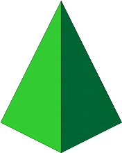
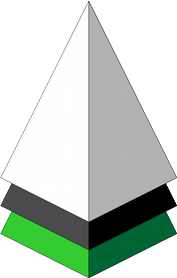
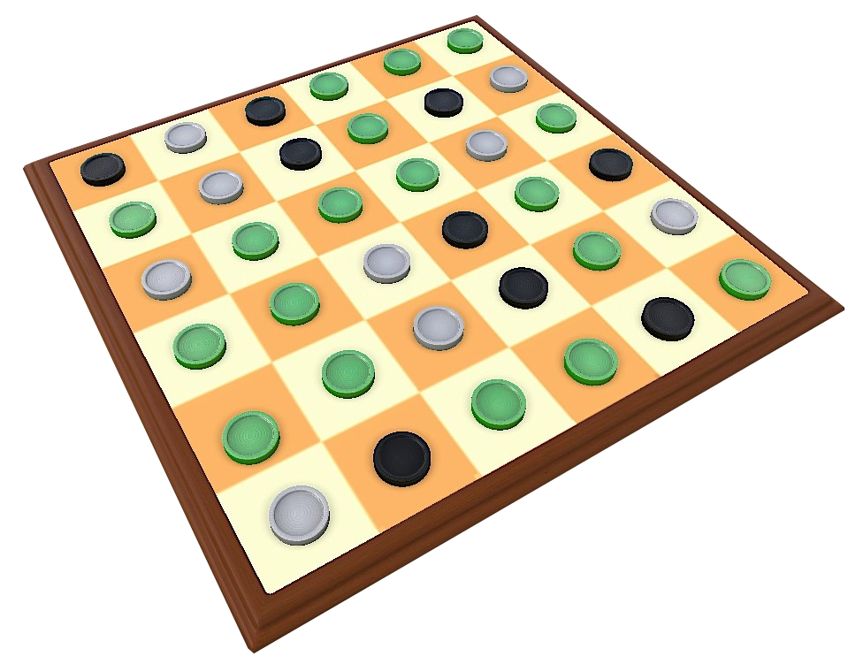
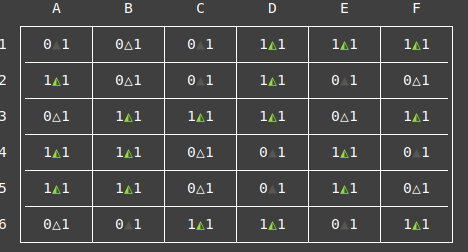
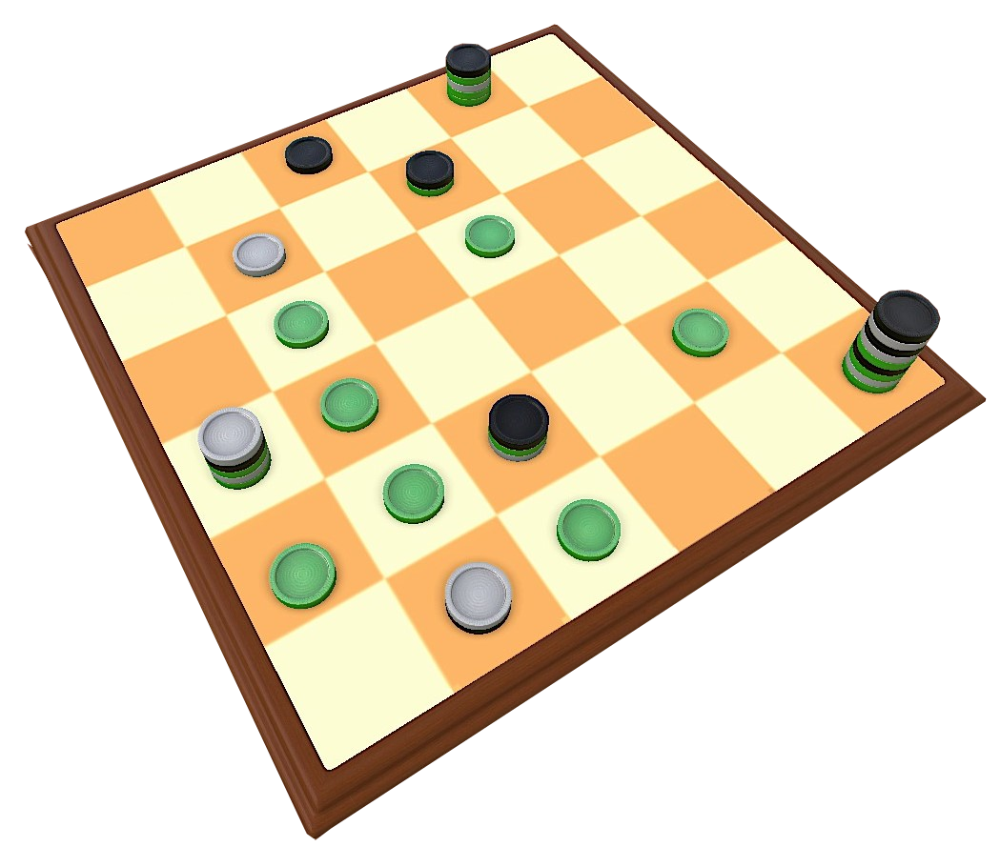
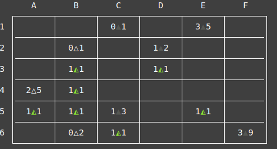
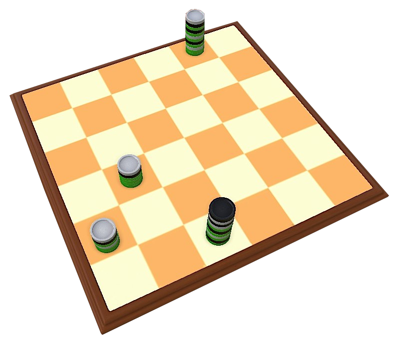
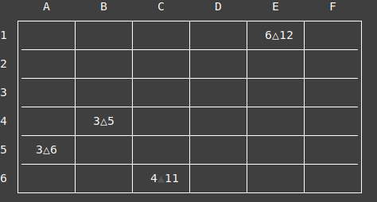

# Green-Greener-Greenest ⚪🟢⚫


## Authors

This project was developed by *Greener1 / Class 4*, of which the members are:

- Ana Inês Oliveira de Barros (*up201806593*)
- Eduardo da Costa Correia (*up201806433*)


## Greener


**Greener** is a capturing game for 2 players, where both must capture the same colour.


### Material

**Basic:** a 6×6 board, 15 black pyramids, 20 green pyramids, 15 white pyramids.


### Definition

A **stack** is either one pyramid or several pyramids stacked on top of each other.
It is controlled by the colour of the topmost pyramid. 
So a White ⚪ stack is a stack of any height with a white pyramid on top, and so on...
 


### Setup

The board starts full of pyramids, randomly placed. 
Each player has an allocated colour (Black ⚫ / White ⚪) and they control every piece or stack of their respective color.
Green 🟢 is a neutral colour.


### How to play

Players take turns (starting by Black ⚫) capturing pyramids or stacks of any colour orthogonally (on the same row or collumn and with no stacks between them).
On your turn you must make one capture if possible, otherwise you pass the turn.
The game ends when all players pass in succession.
The player with the most green  pyramids captured (being part of stacks they control) wins the game. 
In case of a tie, the player with the highest stack wins. If the tie persists, play again.

### Gameplay Overview

Here's an example of a typical turn in the game.
In this case, it's the black player's turn, so they could move either the stack **c** or **a**.
In this case, they could capture the stack  **b**, **c**,, **d** or **e**, but not **f** because **e** is in between.
Capturing **b** is the best move Black ⚫ can make, since it not only gives him one more green piece, it also forfeits White's ⚪ control of that stack.


### More Info

- [BoardGameGeek entry](https://boardgamegeek.com/boardgame/227145/greengreenergreenest)
- [Official Rules](https://nestorgames.com/rulebooks/GREENGREENERGREENEST_EN.pdf)

## Game Structure

### Pieces, Stacks & Cells

The number of pieces on the board is fixed. There are 36 pieces 18 of the pieces are green, 9 are black and the other 9 are white.

To represent each piece we use these atoms:
- **w** is a White piece
- **b** is a Black piece
- **g** is a Green piece

All the playable pieces are put on the board at the start of the game. For that reason, there is no need to represent pieces that are outside the table. 

On the other hand, captured pieces are important since winning the game depends on the height of the stack and the number of green pieces in a stack. This means we have to store captured pieces in order to count the height of a stack and the number of green pieces. By representing a cell as a list, we can store all this information.

**Examples:**
- **[]** is an empty cell
- **[w]** is a cell with a white piece
- **[w, g, b]** is a cell with a white stack (the top piece is white).

### Game State / Board

To internally store the **Game State** we used a list of lists that represents the board cells and the stacks in each one of them. In other words, the board is a list and has a list of rows. Each row has a list of cells. Each cell is a list of pieces since we can have multiple pieces in a cell. Here is an example of how a Game State is stored:

```prolog
% GameState Representation

[
[[b], [w], [b], [g], [g], [g]],
[[g], [w], [b], [g], [b], [w]],
[[w], [g], [g], [g], [w], [g]],
[[g], [g], [w], [b], [g], [b]],
[[g], [g], [w], [b], [g], [w]],
[[w], [b], [g], [g], [b], [g]]
]
```

## Game Visualization

In our code, *display_board/1* is responsible for displaying the GameState. We display the board row by row and we take advatage of *print/1* to print the numbers and of *put_code* in order to print ascii characters so we can have a pretty and formatted way of displaying the board.

Our representation uses several Unicode characters and has to be monospaced font, so we recommend using *Cascadia Mono*, that already comes with the default SicStus installation.

In each cell we have 2 numbers and a Unicode character separating them. The number on the right represents the number of green pieces of the cell/stack. The number on the left represents the height of the stack in the cell. The unicode character represents the color of the top piece of the stack and is one of these:

- △ - White Piece
- ◭ - Green Piece
- ▲ - Black Piece

We included some mockups for comparison and better visualization.


<br>

### Initial State

**Mockup**



**Our display of the board**

<br>

**Obtained by running this:**

```prolog
display_board(
[[[b], [w], [b], [g], [g], [g]],
[[g], [w], [b], [g], [b], [w]],
[[w], [g], [g], [g], [w], [g]],
[[g], [g], [w], [b], [g], [b]],
[[g], [g], [w], [b], [g], [w]],
[[w], [b], [g], [g], [b], [g]]]).
```

### Middle State

**Mockup**



**Our display of the board**

<br>

**Obtained by running this:**

```prolog
display_board(
[[[], [], [b], [], [b, g, w, g, g], []],
[[], [w], [], [b, g], [], []],
[[], [g], [], [g], [], []],
[[w, b, g, w, g], [g], [], [], [], []],
[[g], [g], [b, g, w], [], [g], []],
[[], [w, b], [g], [], [], [b, w, b, w, g, b, g, w, g]]]).
```

### Final State

**Mockup**



**Our display of the board**

<br>

**Obtained by running this:**

```prolog
display_board(
[[[], [], [], [], [w, b, g, b, g, w, g, b, g, w, g, g], []],
[[], [], [], [], [], []],
[[], [], [], [], [], []],
[[], [w, b, g, g, g], [], [], [], []],
[[w, b, g, w, g, g], [], [], [], [], []],
[[], [], [b, w, b, w, g, b, g, w, g, b, g], [], [], []]]).
```


## Generating a board (initial GameState)

As the rules of the game state, the initial board must have the pieces randomly distributed across the board. To achieve this, we start with a list with all the pieces

```prolog
% List with full set of pieces
% 9 blacks, 9 whites & 18 greens 
pieces(
['w', 'w', 'w', 'w', 'w', 'w', 'w', 'w', 'w',
 'g', 'g', 'g', 'g', 'g', 'g', 'g', 'g', 'g', 
 'g', 'g', 'g', 'g', 'g', 'g', 'g', 'g', 'g',
 'b', 'b', 'b', 'b', 'b', 'b', 'b', 'b', 'b']).
```

 Then, we shuffle them and fill the empty board row by row. Demonstrated here:

 ```prolog
% Shuffles list of all pieces
shuffle_board(Shuffled) :-
    pieces(P),
    random_permutation(P, Shuffled).

% Generates random board 
generate_board :-
    now(T), % used for randomness
    setrand(T),
    shuffle_board(Shuffled), % Returns suffled list of all pieces
    fill_board(Shuffled, Board), % Fills board using the shuffled list
    assert(initial(Board)).
 ```